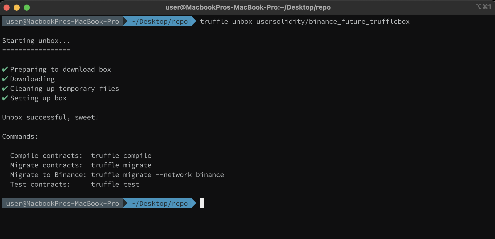

# Binance Truffle Binance Testnet Template Box

Truffle [1] is a world class development environment, testing framework and asset pipeline for blockchains using the Ethereum Virtual Machine (EVM), aiming to make life as a developer easier.

Truffle Boxes [2] are helpful boilerplates that allow you to focus on what makes your dapp unique. In addition to Truffle, Truffle Boxes can contain other helpful modules, Solidity contracts & libraries, front-end views, etc. 

With this project is a boiler plate for truffle configuration with Binance Testnet :) 


## Installation

In the command line 
`truffle unbox usersolidity/binance_future_trufflebox`

and you will get a full Solidity -Truffle template to upload to Binance testnet :) 


[](https://www.youtube.com/watch?v=https://youtu.be/q_a53W9ZkkM)


## Snapshots



## Videos


https://youtu.be/q_a53W9ZkkM
https://youtu.be/D36PhP3Vtss


## Use of Truffle Binance Testnet Template 

### Install truffle 


https://www.trufflesuite.com/docs/truffle/getting-started/installation

Download ("unbox") the Binance Truffle Box:

```
npm install 
npm audit fix
npm install   @truffle/hdwallet-provider
npm audit fix
```

rename .env.example to .env and configure

```
MNEMONIC = 
URL_BINANCE_TESTNET = 
URL_BINANCE_MAINNET = 
BINANCE_API_KEY = 
```
### Install dependencies
`npm install`

 
 
Migrate your contract to the Binance Smart Chain 
`truffle migrate --network binance`
Also you can very the deployed contract 

`truffle run verify Migrations --network binance`

## Video 


## REFERENCES  
[1] https://www.trufflesuite.com/
[2]https://www.trufflesuite.com/boxes
*NOTE:* BINANCE_API_KEY is the generated key api for verify constracts (optional)
https://bscscan.com/myapikey 

